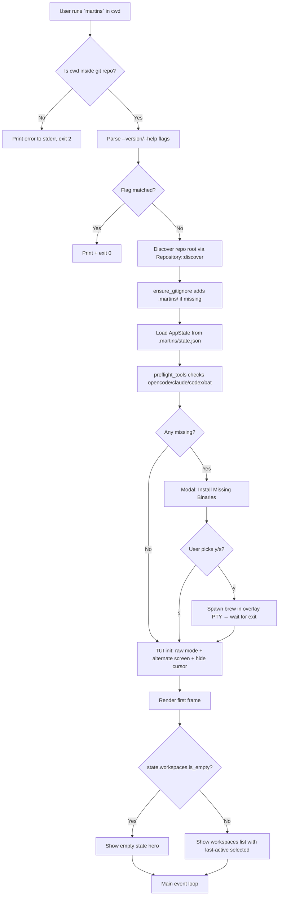
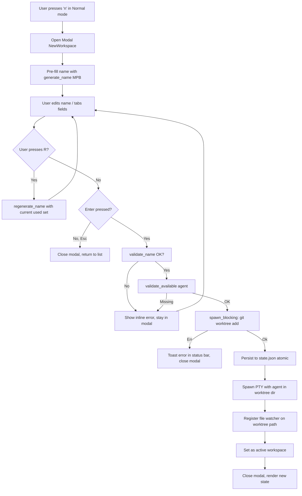
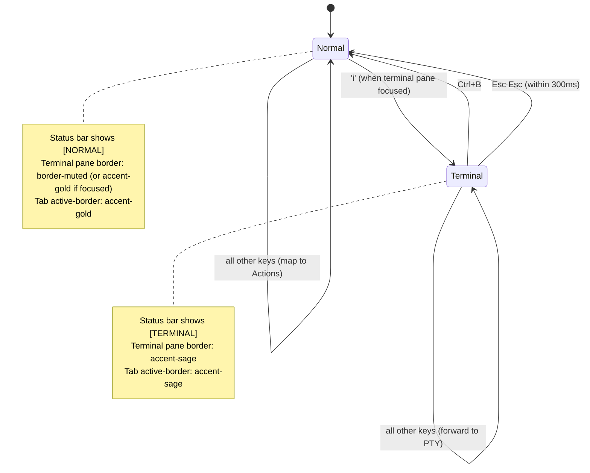
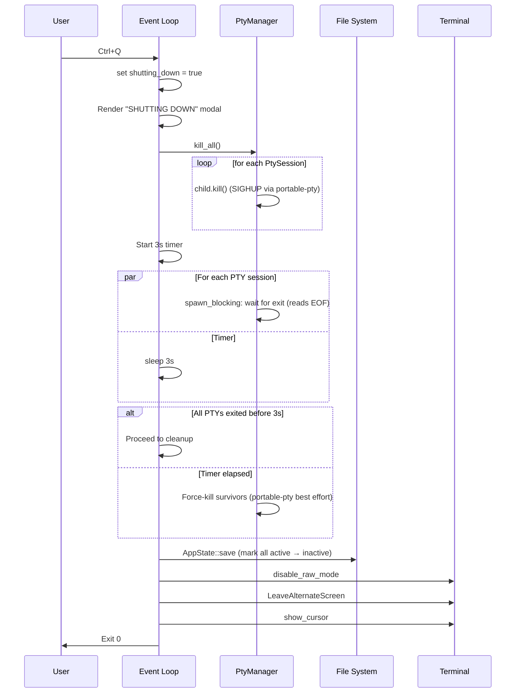
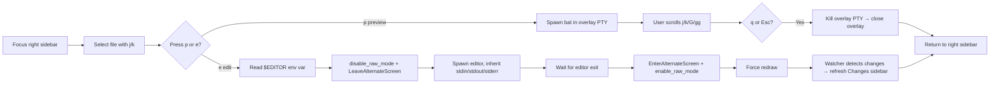

# martins — UI Specification

> Companion design document to `martins-tui.md`. Defines visual language, component specs, screen states, and flow diagrams for the Sisyphus executor implementing Waves 3 and 4 (T15–T22).
>
> **Visual reference**: Paper canvas has 20 screen mockups — see `## Screen Catalog` for the mapping. The ASCII art below is the authoritative text spec; Paper mockups are for visual reference.

---

## Table of Contents

1. [Design Tokens](#design-tokens)
2. [Typography](#typography)
3. [Iconography Lexicon](#iconography-lexicon)
4. [Layout System](#layout-system)
5. [Component Specifications](#component-specifications)
6. [Screen Catalog](#screen-catalog)
7. [Flow Diagrams](#flow-diagrams)
8. [Mode Indicator Contract](#mode-indicator-contract)
9. [Color Semantics](#color-semantics)
10. [Responsive Behavior](#responsive-behavior)
11. [Accessibility](#accessibility)

---

## Design Tokens

### Color Palette

All colors must be defined once in `src/ui/theme.rs` as `ratatui::style::Color` constants. Terminal emulators normalize these to their own palettes — values below are reference RGB; on 16-color terminals fall back to named ANSI.

| Role | Hex | Ratatui Color | Usage |
|------|-----|---------------|-------|
| `bg-base` | `#1a1814` | `Color::Rgb(26, 24, 20)` | App background (warm near-black) |
| `bg-surface` | `#22201c` | `Color::Rgb(34, 32, 28)` | Status bar, tab bar, headers |
| `bg-selected` | `#2a2621` | `Color::Rgb(42, 38, 33)` | Selected list item background |
| `border-muted` | `#3a3631` | `Color::Rgb(58, 54, 49)` | Pane borders, dividers |
| `text-primary` | `#e8e3d8` | `Color::Rgb(232, 227, 216)` | Primary text (warm off-white) |
| `text-secondary` | `#b8b3a8` | `Color::Rgb(184, 179, 168)` | Body text, inactive selections |
| `text-muted` | `#8a847a` | `Color::Rgb(138, 132, 122)` | Labels, hints, hotkey descriptions |
| `text-dim` | `#5a554c` | `Color::Rgb(90, 85, 76)` | Separators, timestamps, subtle marks |
| `accent-gold` | `#d4a574` | `Color::Rgb(212, 165, 116)` | Normal mode, selection, primary action (burnt gold) |
| `accent-sage` | `#8ba888` | `Color::Rgb(139, 168, 136)` | Terminal mode, success, added files (sage green) |
| `accent-terra` | `#c27a6f` | `Color::Rgb(194, 122, 111)` | Errors, warnings, destructive actions (terracotta) |

### Spacing Scale (character cells)

TUIs measure in character cells, not pixels. All spacing is in columns × rows.

- `space-xs` — 1 column
- `space-sm` — 2 columns
- `space-md` — 4 columns (default gap between panel content and border)
- `space-lg` — 8 columns (section separation)

Vertical: 1 row between list items; 2 rows between sections within a pane.

### Border Styles

```
Default pane border:      ─ │ ┌ ┐ └ ┘ (Unicode box-drawing, single)
Active pane border:       (same chars, color = accent-gold or accent-sage)
Modal border:             (same chars, color = accent-gold, or accent-terra for destructive)
```

**Do NOT use double-line borders** (`═ ║`) — reserves that weight for a future feature.

---

## Typography

TUIs use ONE font — whatever the user's terminal has selected (typically JetBrains Mono, Fira Code, SF Mono). We don't control this.

**Hierarchy is built via:**

1. **Color** — primary vs muted
2. **Style** — `bold`, `italic`, `underline`
3. **Case** — `UPPER CASE` for section labels, `lower-kebab` for workspace names
4. **Spacing** — whitespace around content

**Style cheatsheet:**

- Section labels (`Workspaces`, `Changes`): `bold` + `text-muted` + UPPERCASE
- Selected item name: `bold` + `text-primary`
- Inactive item name: regular + `text-secondary`
- Status values (`active`, `exit 42`): regular + color-by-semantics
- Modal titles (`NEW WORKSPACE`): `bold` + UPPERCASE + `accent-gold`
- Hints (`n new · / search`): regular + `text-muted`, with hotkey letter in `accent-gold`
- Error messages: `bold` + `accent-terra`

---

## Iconography Lexicon

Every symbol has a single meaning. Do not reuse or introduce synonyms.

| Symbol | Unicode | Meaning | Color |
|--------|---------|---------|-------|
| `●` | U+25CF | Workspace: active (PTY running) | `accent-sage` |
| `○` | U+25CB | Workspace: inactive (no PTY) | `text-muted` |
| `◐` | U+25D0 | Workspace: exited with error | `accent-terra` |
| `⋯` | U+22EF | Workspace: archived | `text-dim` |
| `›` | U+203A | Input prompt / chevron | `accent-gold` |
| `▼` | U+25BC | Expanded section header | `text-dim` |
| `▶` | U+25B6 | Collapsed section header | `text-dim` |
| `✓` | U+2713 | Success, step complete | `accent-sage` |
| `✗` | U+2717 | Failure, missing binary | `accent-terra` |
| `⚠` | U+26A0 | Warning (used sparingly, only in destructive modals) | `accent-terra` |
| `M` | — | File modified | `accent-gold` |
| `A` | — | File added | `accent-sage` |
| `D` | — | File deleted | `accent-terra` |
| `R` | — | File renamed | `text-secondary` |
| `?` | — | File untracked | `text-muted` |
| `☐` `☑` | U+2610 U+2611 | Checkbox off / on | `text-muted` / `accent-gold` |

**Forbidden**: `⚡` `🚀` `🎉` emoji. martins is a terminal tool — no emoji except `⚠` for warnings and `🍺` if echoed from external tools like brew.

---

## Layout System

### Overall Structure

```
┌─────────────────────────────────────────────────────────────────────────────────┐
│                            [ terminal title bar ]                              │ ← host terminal chrome (not ours)
├─────────────────────────────────────────────────────────────────────────────────┤
│ ┌─────────────┬──────────────────────────────────────┬─────────────────────┐  │
│ │             │                                      │                     │  │
│ │  SIDEBAR    │         TERMINAL PANE                │  SIDEBAR RIGHT      │  │ ← TUI content area
│ │  LEFT       │         (PTY + tab bar)              │  (Changes)          │  │
│ │             │                                      │                     │  │
│ └─────────────┴──────────────────────────────────────┴─────────────────────┘  │
│ [MODE]  workspace · tab X/N · agent               hints · / · ?                │ ← status bar (1 row)
└─────────────────────────────────────────────────────────────────────────────────┘
```

### Pane Width Allocation

- **Left sidebar**: `max(20, min(30, frame_width * 0.20))` cols
- **Right sidebar**: `max(20, min(30, frame_width * 0.20))` cols
- **Terminal pane**: remaining columns after sidebars and borders

### Minimum Viable Dimensions

- **Full layout** (all 3 panes): width ≥ 120 cols, height ≥ 30 rows
- **Left + terminal only**: 100 ≤ width < 120
- **Terminal only**: 80 ≤ width < 100
- **Error message** "Resize to at least 80×24": width < 80 or height < 24

---

## Component Specifications

### C1. Title Bar (host terminal chrome)

Not rendered by martins — this is the user's terminal emulator (iTerm2, Ghostty, etc). Our UI begins below it. Mockups show it for context only.

### C2. Sidebar Left

```
┌ martins ─────────────────┬ main ┐    ← Header: repo basename + current branch
│ WORKSPACES               │      │    ← Section label (uppercase, muted)
│ ● caetano         2/3    │      │    ← Active workspace (selected)
│ ○ gil              —     │      │    ← Inactive workspace
│ ◐ elis          exit 42  │      │    ← Exited workspace
│                          │      │
│ ▼ ARCHIVED  3            │      │    ← Collapsible section
│   ⋯ chico                │      │
│   ⋯ djavan               │      │
│   ⋯ caetano-2            │      │
└──────────────────────────┴──────┘
```

**Rules:**
- Selected item: `bg-selected` background + left border `accent-gold` (2-col wide)
- Trailing counter (`2/3`, `—`, `exit N`) right-aligned with `space-md` from name
- Archived items rendered in `text-muted`, indented 2 cols
- Scrollable when list exceeds available height (ratatui `ListState` with scrollbar in rightmost column)
- Empty state: `"No workspaces. Press 'n' to create one."` centered

### C3. Terminal Pane

```
┌──────────────────────────────────────────────────────────────────┐
│ 1 opencode │ 2 zsh  │ 3 zsh  │                                  │ ← Tab bar
├────────────┴────────┴────────┴──────────────────────────────────┤
│                                                                  │
│ opencode v0.3.2                                                  │
│ Project: martins-caetano (branch: caetano)                       │
│                                                                  │
│ > add authentication middleware to the api module                │
│                                                                  │ ← PTY content
│ I'll add an authentication middleware. Let me first look at...   │   (vt100 parser)
│                                                                  │
│ ● Read src/api/mod.rs                                            │
│ ● Read src/api/routes.rs                                         │
│ ● Write src/api/middleware/auth.rs                               │
│                                                                  │
│ > yes, continue █                                                │ ← cursor
└──────────────────────────────────────────────────────────────────┘
```

**Rules:**
- Tab bar: 1 row. Active tab has `accent-gold` top-border (Normal mode) or `accent-sage` (Terminal mode).
- Tab label format: `N label` where `N` is 1-5 and `label` is `opencode`, `claude`, `codex`, or `zsh`.
- Max 5 tabs per workspace. 6th attempt shows modal error.
- PTY content rendered by `tui-term::widget::PseudoTerminal` widget.
- Cursor visible only when tab is active AND the PTY's parser reports cursor as visible.

### C4. Sidebar Right (Changes)

```
┌ Changes ──────────────── 4 ┐
│ vs main                    │      ← Base branch indicator
├────────────────────────────┤
│ ? middleware/auth.rs       │      ← Untracked
│ A api/types.rs             │      ← Added
│ M api/routes.rs            │      ← Modified (selected)
│ M Cargo.toml               │      ← Modified
└────────────────────────────┘
```

**Rules:**
- Fixed-width status column: 1 col (M/A/D/R/?), colored per icon lexicon
- Path truncation: if path wider than available, prefix with `...` and show tail (e.g., `...middleware/auth.rs`)
- Sort: untracked first, then alphabetical by path within status groups
- Empty state: `"No changes."` centered
- Error state: border `accent-terra`, show error message with suggestions (see Screen 19)

### C5. Status Bar

```
┌─────────────────────────────────────────────────────────────────┐
│ [NORMAL]  caetano · tab 1/3 · opencode      i term  n new  / search  ? help │
└─────────────────────────────────────────────────────────────────┘
```

**Rules:**
- Mode badge: 1 col padding + uppercase 6-char badge (`NORMAL` or `TERMINAL`) on `accent-gold`/`accent-sage` background, `bg-base` text.
- Left section: mode · workspace · tab counter · agent (only when a workspace is active)
- Right section: contextual hints, each as `<hotkey> <description>` with hotkey in `accent-gold`
- In Terminal mode: hint section reduces to `Ctrl+B normal · Keys forward to PTY`

### C6. Modal (generic contract)

All modals follow the same shell:

```
┌ TITLE ──────────────────────────── Esc to cancel ┐
│                                                   │
│  <content>                                        │
│                                                   │
├───────────────────────────────────────────────────┤
│ <left hints>                      <confirm hint>  │
└───────────────────────────────────────────────────┘
```

**Rules:**
- Centered horizontally and vertically with `ratatui::widgets::Clear` overlay
- Background dim: `0.6` alpha black overlay behind (in TUI, simulated by dim-colored fill)
- Min width: 40 cols. Max width: 60% of frame or 80 cols, whichever is smaller.
- Border: `accent-gold` for neutral, `accent-terra` for destructive
- Title: `bold` + uppercase, color matches border
- Footer: 1 row, split left/right. Right side always has `↵ <action>` in `accent-gold`.
- `Esc` ALWAYS cancels. This is inviolable.

### C7. Preview Overlay

```
┌ File  src/api/routes.rs      72 lines · Rust · q to close · j/k scroll ┐
│                                                                          │
│   1 use axum::{Router, routing::{get, post}};                            │
│   2 use crate::middleware::auth;                                         │
│   3                                                                      │
│   4 pub fn build_router() -> Router {                                    │
│   5     Router::new()                                                    │
│ > 6         .route("/health", get(health_check))                         │ ← current line
│   7         .route("/api/users", get(list_users))                        │
│   8         .layer(auth::middleware())                                   │
│   9 }                                                                    │
│                                                                          │
└──────────────────────────────────────────────────────────────────────────┘
```

**Rules:**
- 90% of frame, centered
- Header row: filename + metadata (line count, language, keybindings)
- Content: spawns `bat --paging=always --color=always {file}` in a PTY; if bat missing, fall back to `less` or `cat`
- Forwards key events to the PTY (bat/less handles `j/k/G/gg`). Only `q` and `Esc` are intercepted to close.

### C8. Fuzzy Picker

```
┌─────────────────────────────────┐
│ > cae█                          │   ← input with cursor
├─────────────────────────────────┤
│ WS   caetano         ● active   │   ← selected (bg-selected + border)
│ WS   caetano-2       ⋯ archived │
│ FILE src/api/cache.rs     M     │
│ FILE tests/cae_test.rs    A     │
├─────────────────────────────────┤
│ 4 of 58 matches    ↑↓ ↵ open    │
└─────────────────────────────────┘
```

**Rules:**
- Width: 60% of frame; height: auto up to 50% of frame
- Kind prefix (`WS`, `FILE`) in 4-col fixed slot, `text-muted`, uppercase
- Match highlight: matched chars in `accent-gold` on the filename
- Footer: match count + navigation hints

---

## Screen Catalog

Each screen has a Paper mockup node (see Paper canvas "Martins") AND an ASCII representation below. Paper nodes are visual reference; ASCII is authoritative for implementation.

| # | Name | Paper Artboard | Use Case |
|---|------|----------------|----------|
| 01 | Base layout · Normal mode · opencode running | `01 — Layout base (Normal mode, opencode running)` | Default view with active workspace |
| 02 | Base layout · Terminal mode | `02 — Layout base (Terminal mode, PTY active)` | After pressing `i` |
| 03 | Modal: New Workspace | `03 — Modal: New Workspace` | After pressing `n` |
| 04 | Modal: Confirm Delete (with unpushed warning) | `04 — Modal: Confirm Delete (with unpushed warning)` | After `d` on workspace with unpushed commits |
| 05 | Modal: Install Missing Binaries | `05 — Modal: Install Missing Binaries (pre-flight)` | On startup when tools are missing |
| 06 | Bat Preview Overlay | `06 — Bat Preview Overlay` | After `p` on a file |
| 07 | Fuzzy Picker | `07 — Fuzzy Picker (workspaces + files)` | After `/` |
| 08 | Empty State | `08 — Empty State (first run)` | First run in a repo, no workspaces |
| 09 | Workspace Exited | `09 — Workspace Exited (PTY died with exit code)` | Agent crashed |
| 10 | Error: Not a git repo | `10 — Error: Not a git repository` | `martins` outside git repo (no TUI) |
| 11 | Responsive 110 cols | `11 — Responsive: 110 cols (right sidebar hidden)` | Narrow viewport |
| 12 | Responsive 85 cols | `12 — Responsive: 85 cols (both sidebars hidden)` | Very narrow viewport |
| 13 | Help Overlay | `13 — Help Overlay (?)` | After `?` |
| 14 | Graceful Shutdown | `14 — Graceful Shutdown (Ctrl+Q in progress)` | After Ctrl+Q with running agents |
| 15 | Modal: Confirm Delete (safe) | `15 — Modal: Confirm Delete (no unpushed, safe)` | After `d` on clean workspace |
| 16 | Workspace switching | `16 — Workspace switching (transition state)` | After Enter on inactive workspace |
| 17 | Multi-tab workspace | `17 — Multi-tab workspace (opencode + zsh + build)` | Workspace with multiple tabs |
| 18 | Archive section expanded | `18 — Full archive section expanded (many archived)` | Long archive history |
| 19 | Error: base branch missing | `19 — Error: base branch missing` | Base branch deleted externally |
| 20 | Install in progress | `20 — Install binaries in progress (PTY running brew)` | After `y` on install modal |

### Screens NOT Mocked (text-only spec below)

These edge cases are specified textually to keep the Paper canvas focused. Implementation follows the components defined above.

**21. Name collision resolution**: When `generate_name` exhausts all 50 artists and must append `-N`:
```
[Notification row at top of sidebar, auto-dismisses after 3s]
ℹ all 50 MPB names in use. Generated: caetano-2
```

**22. State.json corrupted fallback**: On load failure:
```
[Subtle notification in status bar, persists until dismissed]
⚠ state.json corrupted — loaded from backup (3 workspaces recovered)
```

**23. Read-only repo (.martins/ fallback)**: At startup, if `.martins/` can't be created in repo:
```
[Modal, dismissible]
NOTICE — repo is read-only
State saved to ~/.local/share/martins/<hash>/state.json instead.
[↵ Continue]
```

**24. Pre-flight check PASSES (happy path)**: Skipped modal — martins proceeds directly to the TUI with a subtle status bar message for 2s: `✓ all tools found (opencode, claude, codex, bat)`

**25. Terminal resize in progress**: No dedicated screen. Ratatui redraws on `Event::Resize`; PTY is notified via `master.resize()` same frame. Visual feedback is implicit.

**26. Archive hover (inactive workspaces)**: Same as active selection highlight, but item text remains `text-secondary` rather than `text-primary`.

**27. Tab close confirmation (when PTY has running subprocess)**: Not specified in MVP — close is instant. Cost of graceful subprocess tracking outweighs benefit.

**28. Picker: no matches**: Picker renders with empty body and footer: `0 matches · Esc to cancel`.

**29. Agent selection failure mid-creation**: If PTY spawn fails after worktree is created, worktree is preserved but workspace status becomes `Exited(-1)`. User can press `r` to retry.

**30. First-run `.gitignore` modification notice**: One-time notification on first workspace creation:
```
[Status bar, auto-dismisses after 4s]
ℹ .martins/ added to .gitignore
```

---

## Flow Diagrams

### F1. First-run flow



### F2. Create workspace flow



### F3. Input mode transition



### F4. Graceful shutdown sequence



### F5. File preview + edit flow



---

## Mode Indicator Contract

**The mode indicator is THE most important visual in martins.** It must be unmissable. Contract below is non-negotiable.

### Normal Mode

- Status bar badge: `[NORMAL]` in `bg-base` text on `accent-gold` fill
- Focused pane border: `accent-gold`
- Active tab top-border: `accent-gold`
- Cursor in terminal pane: NOT shown (hidden, because keys don't go to PTY)

### Terminal Mode

- Status bar badge: `[TERMINAL]` in `bg-base` text on `accent-sage` fill
- Focused pane border: `accent-sage` (for the terminal pane only; other panes remain muted)
- Active tab top-border: `accent-sage`
- Cursor in terminal pane: SHOWN and matches vt100 parser state (blinking if parser says blink)

### Transition Feedback

No animation in MVP. The frame immediately after `i` or `Ctrl+B` should render with the new mode's colors. Ratatui redraws synchronously, so the transition is a single-frame flip.

---

## Color Semantics

These are rules to resolve ambiguity during implementation:

1. **Gold = "you are in charge"**: Normal mode, selection, primary action, keyboard hints.
2. **Sage = "agent/system is running"**: Terminal mode, active workspace, added files, success states.
3. **Terracotta = "attention required"**: Errors, deleted files, destructive actions, exit codes.
4. **Muted greys = information hierarchy**: Borders, labels, inactive items.
5. **Warm off-white = content**: File contents, agent output, user input.

**Never**:
- Use gold AND sage on the same element (pick one based on mode)
- Use saturated pure red (use `accent-terra`, which is less alarming)
- Invert background/foreground for "inverse" items — use `bg-selected` instead

---

## Responsive Behavior

### Breakpoint Matrix

| Width (cols) | Left Sidebar | Right Sidebar | Terminal Pane | Notes |
|--------------|:------------:|:-------------:|:-------------:|-------|
| ≥ 120 | visible | visible | visible | Full layout |
| 100–119 | visible | hidden | visible | Left + terminal |
| 80–99 | hidden | hidden | visible | Terminal only |
| < 80 | — | — | — | "Resize terminal" message |

### Height Matrix

| Height (rows) | Behavior |
|---------------|----------|
| ≥ 30 | Normal |
| 24–29 | Works but cramped (still rendered) |
| < 24 | "Resize terminal to at least 80×24" |

### User Toggle

- `Ctrl+B` toggles LEFT sidebar (when width permits)
- `Ctrl+N` toggles RIGHT sidebar (when width permits)
- Toggles are no-ops when the sidebar is already force-hidden by breakpoint

### Resize Propagation

On `Event::Resize(new_w, new_h)`:

1. Ratatui redraws with new `Rect`
2. For the active workspace's active tab:
   - `master.resize(PtySize { rows: terminal_pane_rows, cols: terminal_pane_cols, ... })`
   - `parser.write().set_size(terminal_pane_rows, terminal_pane_cols)`

Background tabs are resized on next focus (lazy).

---

## Accessibility

**Terminal accessibility** is limited, but:

1. **No color-only information**: Every status communicated by color is ALSO communicated by a symbol (●, ○, ◐, M/A/D/R).
2. **Contrast**: Text-on-background pairs meet WCAG AA for small text:
   - `text-primary` (`#e8e3d8`) on `bg-base` (`#1a1814`) → ratio 13.4:1 ✓
   - `text-muted` (`#8a847a`) on `bg-base` (`#1a1814`) → ratio 5.1:1 ✓
   - `accent-gold` (`#d4a574`) on `bg-surface` (`#22201c`) → ratio 7.8:1 ✓
   - `accent-terra` (`#c27a6f`) on `bg-surface` (`#22201c`) → ratio 5.3:1 ✓
3. **Keyboard-only**: No mouse required for any action.
4. **High-contrast fallback**: Users with `NO_COLOR=1` env set: render without color, use bold/italic/underline for hierarchy. (Not in MVP scope, documented as v2.)

---

## Implementation Notes for Executor

This spec is consumed during Wave 3 (T15-T21) and Wave 4 (T22). Key reminders:

1. **Theme as constants**: Define all colors in `src/ui/theme.rs` as `const` or `once_cell::sync::Lazy` — avoid scattering raw `Color::Rgb(...)` throughout widgets.
2. **Component builders**: Each component (sidebar_left, sidebar_right, terminal, modal, picker, preview) gets its own module. Reuse status-bar rendering across all screens.
3. **Snapshot tests**: Use `ratatui::backend::TestBackend` + `insta::assert_snapshot!` for every state in the Screen Catalog. Commit `*.snap` files.
4. **Mode indicator first**: Implement T8 (input modes) with a visible indicator BEFORE any widget-specific logic. This is the architectural foundation per Metis review.
5. **Border color helper**: A single function `pane_border_style(focused: bool, mode: InputMode) -> Style` used by all panes — avoids inconsistent border coloring.
6. **Don't invent**: If a state isn't in this spec, surface it as a question, don't improvise. The canvas + this doc are the contract.

---

## Changelog

- **v1** (initial): 20 screen mockups + component specs + flow diagrams + design tokens.
